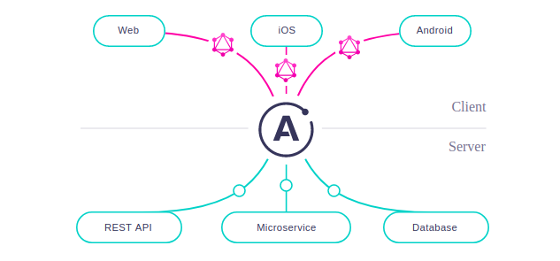

# Apollo Fullstack - Space Launches

- Apollo is used to build data-graph, a communication layer to connect your application client to back-end services 🐥.
  

## Client

## Server

- schema-first development (agree on a schema before you begin implementing your API.)(think of it like: - what our client is going to do with our app?)

#### Responsibilities:

- Fetch a list of all upcoming rocket launches
- Fetch a specific launch by its ID
- Log in the user and if logged in:
  - Book a launch
  - Cancel a previously booked launch
